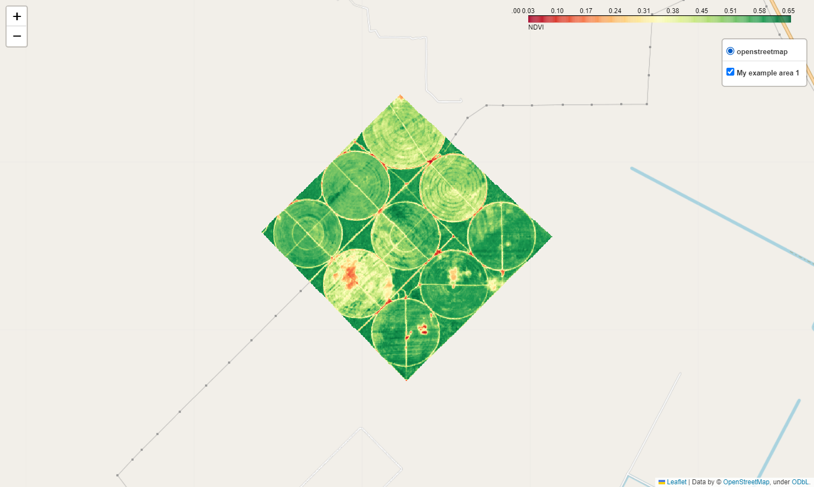
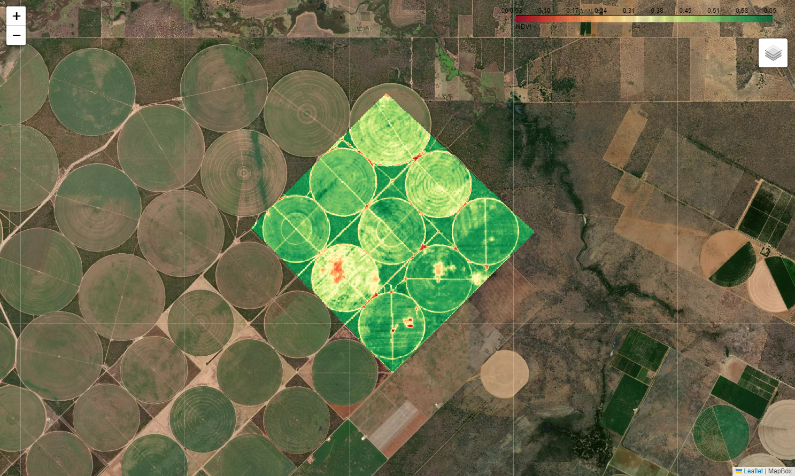

[](https://github.com/psf/black)
# rasterexplorer
A package for quickly viewing raster datasets on an interactive map.

This package was inspired by the method `explore` (from GeoDataFrame objects) implemented by the package geopandas. As geopandas focuses on vector data, this package was created focusing on raster data. It provides a function, also named explore, that allows viewing raster datasets on an interactive map created using folium.

## Installation
**On Windows**, one of the dependencies (rasterio) must be manually installed before installing rasterexplorer. For conda users, this dependency can be easily installed using the command `conda install -c conda-forge rasterio`. After that, rasterexplorer can be installed with pip using the following command:
```
pip install git+https://github.com/lbferreira/rasterexplorer
```
**On Linux**, rasterexplorer can be installed directly using pip.

## Usage examples
When working with raster datasets on a jupyter notebook, quicklying viewing the datasets can be very useful. To do it with rasterexplorer, the following examples can be followed. `input_raster` can be a string with path for the input raster, a DatasetReader object of the lib rasterio, or a RasterData object, which can be created from a numpy masked array.
```
from rasterexplorer import explorer

my_map = explorer.explore(
    input_raster='./example_data/sentinel2/area1/ndvi.tif',
    label='My example area 1',
    band=1,
    cbar_caption='NDVI',
)
my_map
```


A custom tile server can be provided as shown below:
```
tiles = "https://api.mapbox.com/v4/mapbox.satellite/{z}/{x}/{y}@2x.jpg90?access_token=" + my_token
attr = 'MapBox'
my_map = explorer.explore(
    input_raster='./example_data/sentinel2/area1/ndvi.tif',
    label='My example area 1',
    band=1,
    cbar_caption='NDVI',
    tiles=tiles,
    attr=attr,
)
my_map
```


When manipulating rasters in the form of numpy arrays, the interactive map can be created passing a RasterData object to the parameter `input_raster` of the explore function. An example is provided below.
```
from rasterexplorer.raster_data import RasterData

# Loading data from .tif files and extrating data as numpy masked arrays
with rasterio.open('./example_data/sentinel2/area1/b4.tif') as dataset:
    band4 = dataset.read(1, masked=True)
    band4_crs = dataset.crs
    band4_transform = dataset.transform
with rasterio.open('./example_data/sentinel2/area1/b8.tif') as dataset:
    band8 = dataset.read(1, masked=True)

# Computing NDVI
# NDVI = (NIR - RED) / (NIR + RED) where NIR = band4 nad RED = band8
ndvi = (band8 - band4) / (band8 + band4)

# Creating a RasterData object. Note that crs and transform from band4 and band8 are the same ones.
ndvi_raster = RasterData(data=ndvi, crs=band4_crs, transform=band4_transform)

my_map = explorer.explore(
    input_raster=ndvi_raster,
    label='My example area 1',
    band=1,
    tiles=tiles,
    attr=attr,
    cbar_caption='NDVI',
)
my_map
```


If we have data as a conventional numpy array. The following utility method can be used to convert it to a masked array.
```
masked_array = RasterData.to_masked_array(values, nodata)
# values is a numpy array
# nodata is the value used to represent masked areas
```

## Issues
If you find a bug, please report it as an issue.